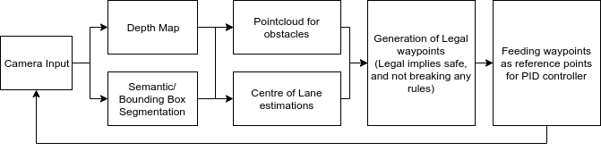

# DeepDrive AD: Developing an ADAS stack on CARLA’s simulated environment

CVI Group: Anand Gokhale, Sai Vinay, Sashank Kaushik, Arjun Menon Vadakkeveedu, Meenakshi CS, Shania Mitra

## Problem Statement

Project Deep Drive tackles an adapted version of the CARLA AD (Autonomous Driving) problem statement. The objective of the project is to create an Advanced Driver Assistance System that would run on the open-source simulator CARLA. The agent is required to reach a target destination following a predefined route, without any traffic infractions. CARLA closely models real-life driving conditions with a diverse set of maps, weather conditions and traffic scenarios.

## Approach
### Detection: 

The approach adopted involves taking camera input from 4 monocular cameras, which are then processed to give a depth map and a semantic segmentation output. 

We observed that the YOLOv3 CNN architecture trained on the COCO training dataset performed well on Carla's synthetic images. Hence this architecture was used for detecting pedestrians, vehicles and infrastructure points on the road such as traffic lights, lamp posts etc.

Our initial attempt to segment road lanes used Linear and Circular Hough Transforms. However, they did not give satisfactory results; thus LaneNet, a deep network was used for the same. Hough transform based segmentation performed poorly in comparison to the deep network at intersections and curves on the road. DeepLab was used to obtain a semantic-segmented map.

The information from the semantic segmentation and depth estimation is combined to calculate the relative positions of the obstacles from the agent. 

Once the relative positions are mapped to the detected objects, waypoints are generated. Waypoints are used to denote the allowed points through which the ego vehicle may traverse and are fed as input to the decision making/control block.
### Decision making/Control:

#### Approach 1: 

We implemented a Reinforcement Learning based Deep Q-Learning model with the following constraints:

1. Maintain the same lane
2. Maintain constant speed
3. Reward of -inf in the event of the agent crashing onto an object

 We tested the performance of the model with these constraints in a single-agent environment. However it was not satisfactory- one instance of the model’s sub-par performance was when the ego vehicle drove to an intersection and went around in circles (all three constraints were satisfied).

We believe the causes for this are:

1. The Deep Q-Learning model used was not sophisticated enough for ADAS. Implementing Reinforcement Learning is still a research topic worldwide (to our knowledge).
2. Hardware limitations: Training a more sophisticated model would have required a more powerful graphics unit than the one we have.
3. The reward structure of the model was not optimal- training a model with optimal rewards was not possible due to hardware limitations.

#### Approach 2, The solution:

The working solution uses a classical decision making and control algorithm. In this, the generated waypoints were used to decide on potential “next-states” of the agent (position, steering angle, speed). A PID-based control system block was used to switch smoothly from one state to another.

Unlike the Deep Q-learning model, this model was simple enough to be implemented and did not have hardware-related latency issues. A brief description of this model is given in the next section.

## Working Solution

Schematic Diagram of the Working Solution

Description of the Decision Making and Control System:

The following rules are used to model both the environment and the behaviour of the agent:

1. Upon detection of relevant traffic signals at an intersection, the agent may move if the signal was green and must stop before the signal in case of a red light.
2. The agent will try to approach an ideal speed using a PID controller.
3. The agent may change lanes only if there is sufficient space on the new lane
4. If there are vehicles with negative relative velocity ahead of the agent in the same lane, the agent must slow down until the relative speed is zero. If the condition in 3 is satisfied, the agent may switch lanes, but only after achieving relative speed of zero wrt the vehicle ahead.

The generated waypoints as mentioned above are used to make decisions according to the above mentioned rules. 

PID control systems are used in order to control the speed and maintain lane stability due to their quick response, stability and easy tuning.

1. For the speed controller, the error of the current speed with the desired speed is fed as input to the PID
2. For lane stability control, the angle made by the agent with the centre of the lane is used as error while the target angle is set to 0°. In case the agent were to change lanes, the error signal is changed to the angle made by the agent with the centre of the target lane. 
